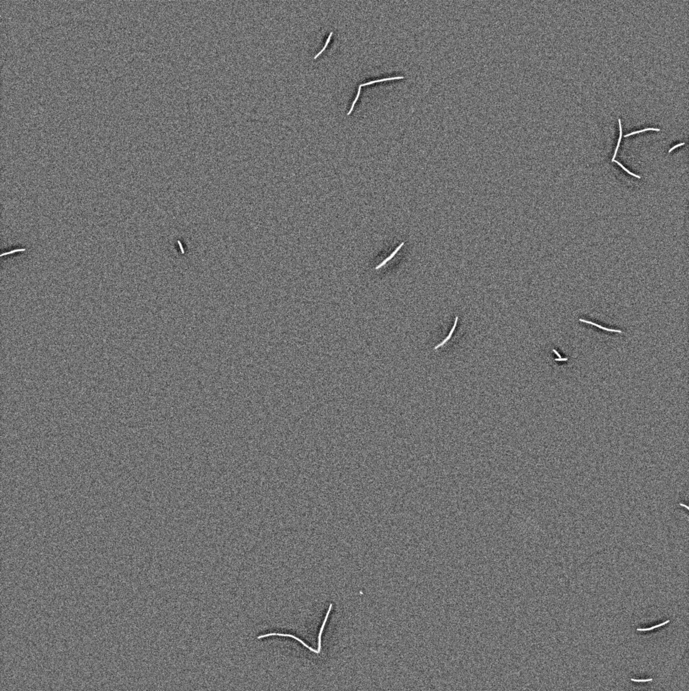
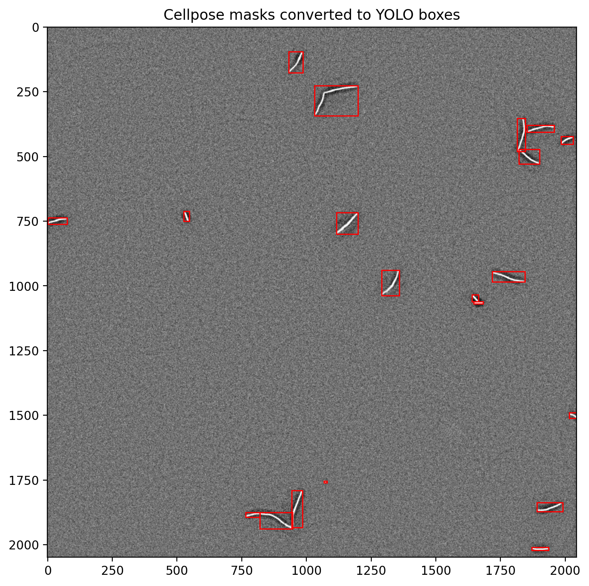
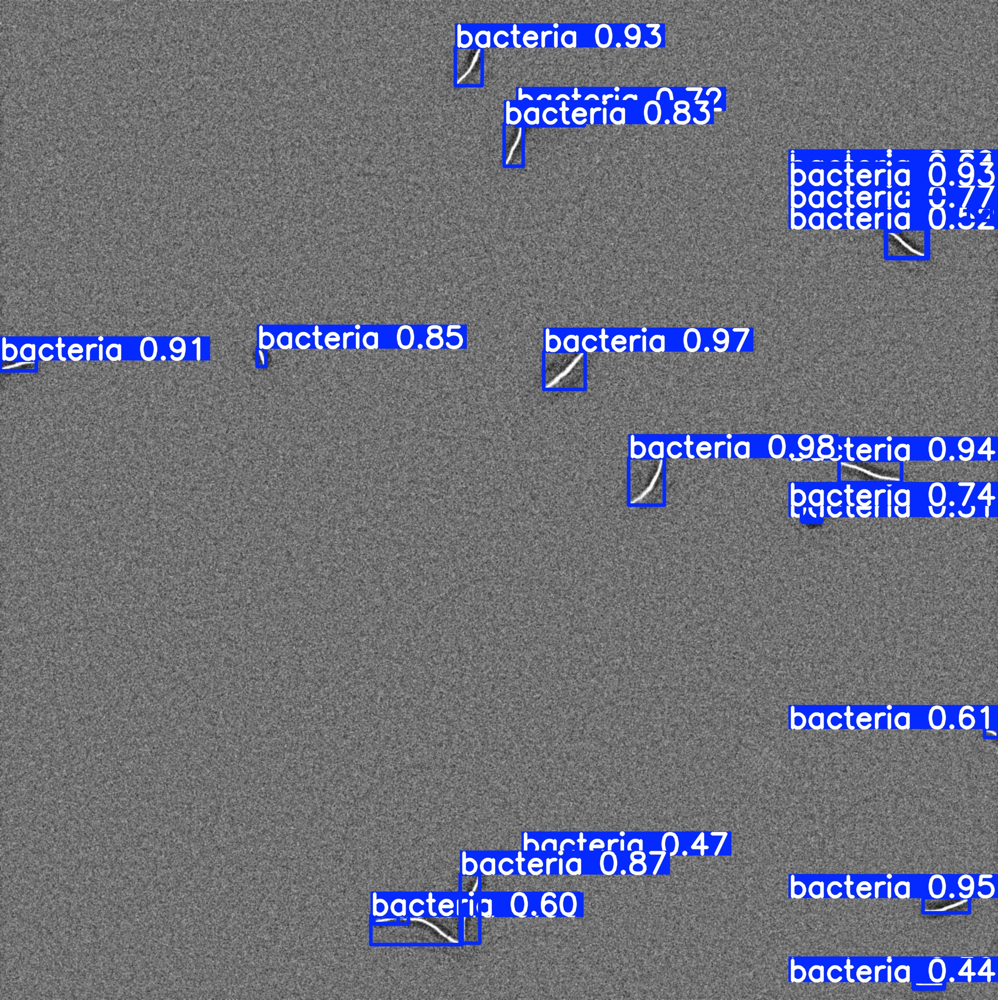

# YOLO for Bacterial Segmentation

## Overview
This project implements a pipeline to train a YOLO model for detecting (filamenting and non-filamenting) bacteria in  20x fluorescence microscopy images. 


The pipeline includes:
- Conversion of microscopy TIFF images to PNG (deletes original TIFFs)
- Dataset splitting into training and validation sets
- Optional tiling of large images for improved detection of small unicellular bacteria at later time points
- Training and evaluation of YOLO models using the Ultralytics framework

The aim of this project is to assess whether:
1. preprocessing of images before feeding to YOLO improves model performance?
2. augmentation during training improves model performance?
3. tiling of images improves model performance and detection of small bacteria?
---
## Example Results

### Input (raw microscopy image)



### Ground Truth (manual annotation)



### Model Prediction


---

## Project Structure

```text
YOLO_for_bacterial_segmental/
├── configs/                # Dataset configuration files (YAML)
├── scripts/                # Executable command-line scripts
├── dataset/                # YOLO-formatted dataset (ignored by git)
│   ├── images/
│   │   ├── train/
│   │   └── val/
│   └── labels/
│       ├── train/
│       └── val/
├── runs/                   # Training outputs (ignored by git)
├── .gitignore
└── README.md
```
---

## Installation

Create a virtual environment and install dependencies:

pip install -r requirements.txt

---

## Dataset Format

The dataset must follow the YOLO format:

```text
dataset/
├── images/
│   ├── train/
│   └── val/
└── labels/
    ├── train/
    └── val/
 ```
    
Each image must have a corresponding .txt file with YOLO annotations that is found in folder *labels*.

---

## Configuration

Dataset configuration file: configs/dataset.yaml
The YAML file tells YOLO where the dataset is located and how the class labels should be interpreted.
It defines:
- the root path of the dataset
- the relative paths to the training and validation images
- the class names used in the annotation files
---

## Pipeline

### 1. (Optional) Convert TIFF images to PNG 

python scripts/convert_tiff_to_jpeg.py --dataset dataset --splits train val

⚠️ This deletes the original TIFF files after conversion.

---

### 2. (Once per project) Split dataset into train/validation

python scripts/splitdataset.py --dataset dataset --val-fraction 0.2 --seed 42

⚠️ This moves files randomly from train to val folder. It is assumed that all images are originally put in the train folder. 

---

### 3. (Optional) Tile dataset

Improves detection of small bacteria:

python scripts/image_tiling.py --input-dataset dataset --output-dataset dataset_tiled --tile-size 512 --stride 384

---

### 4. Train YOLO model

Basic training:

python scripts/train_YOLO.py --model yolov8n.pt --data configs/dataset.yaml --epochs 30 --imgsz 1024  --batch 4

Or for tiled dataset:

python scripts/train_yolo_tiled.py  --model yolo11n.pt  --data configs/data_tiled.yaml  --imgsz 512  --epochs 5  --batch 8

---

## Outputs

Training results are saved in:

runs/

Including:
- weights/best.pt (best model)
- weights/last.pt
- training curves
- prediction outputs

---

## Notes

- Designed for 20x microscopy images with small objects (bacteria)
- Scripts modify datasets in-place (use copies if needed)

---

## Author

Project developed as part of a data science / computer vision workflow for biological image analysis
